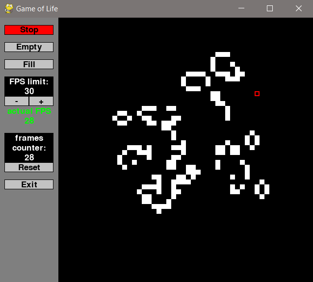

# Conway's Game of Life

## Visualization

## Features & Controls
- **Press _left/right mouse button_ to revive/kill the highlighted cell**
- **Resize window with _mouse_, press _F key_ to change fullscreen mode** 
- **Press _Start/Stop button_ (or _SPACE key_) to start/stop program**
- **Press _Empty and Fill buttons_ to empty or fill the whole board**
- **FPS limiter: use _+- buttons_ to manipulate FPS limit (0 means there is no limit)**
- **Frames counter counts total number of frames since last reset**
- **Press _Exit button_ (or _ESC key_) to exit the program**

## Rules of Conway's Game of Life
- **any live cell with 2 or 3 live neighbours survives**
- **any dead cell with 3 live neighbours becomes a live cell**
- **all other cells die/stay dead in the next generation**
